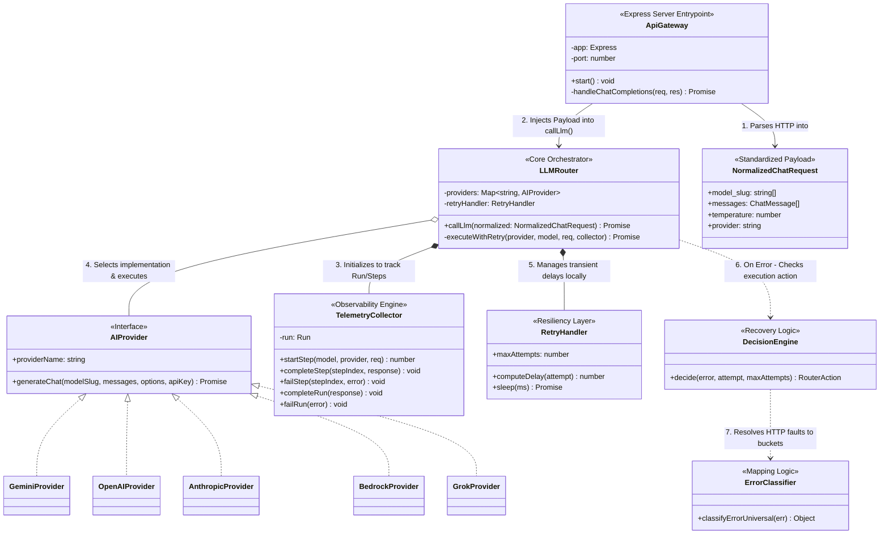

# API Gateway Core Architecture

This diagram highlights the main routing, fallback, and tracking logic of the API implementation. It removes boilerplate components to focus on the application's unique value proposition.

